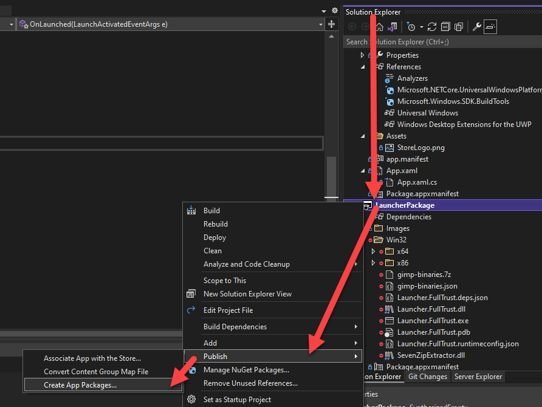
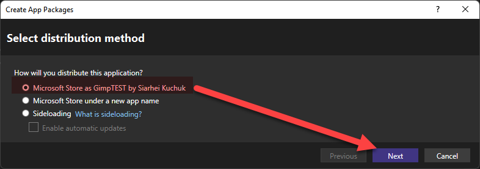
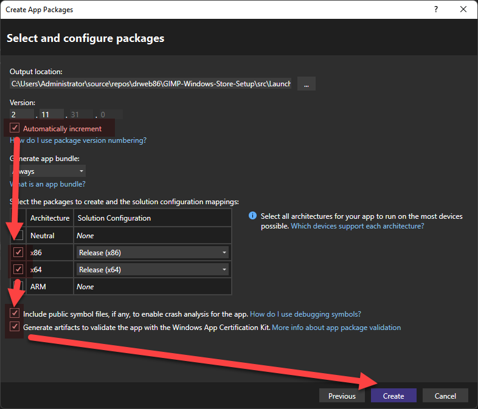
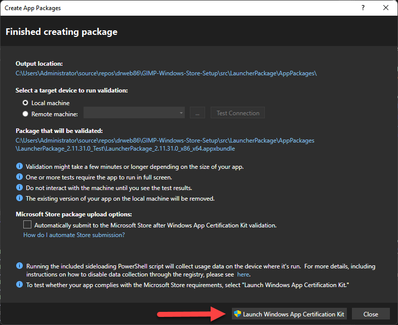
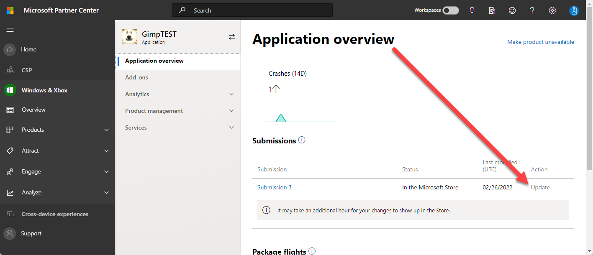
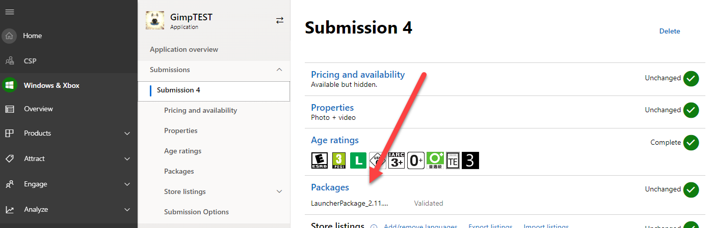
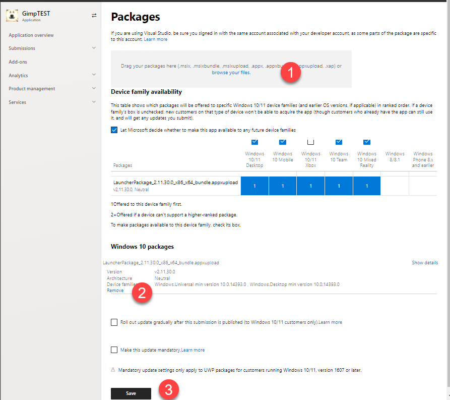
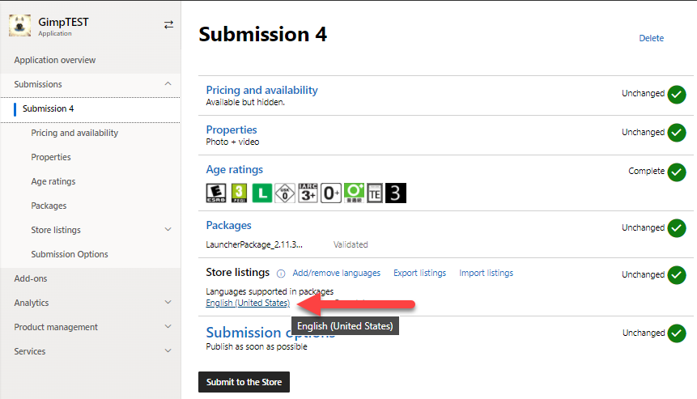
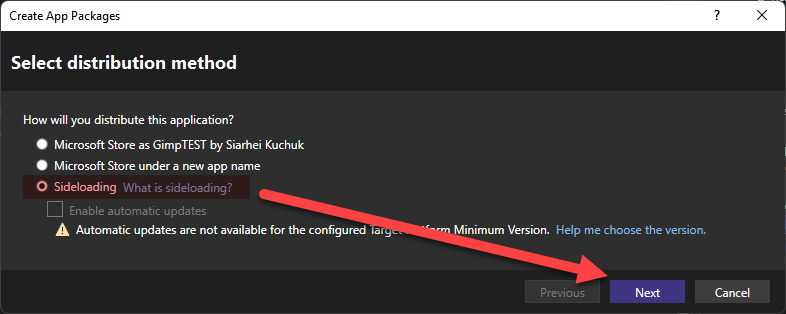
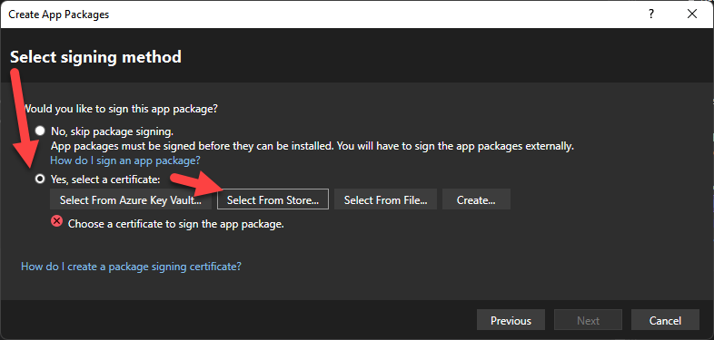

# Submission to Windows Store

This articles describes the workflow of publishing the new version of an application to Windows Store.

In Windows Store terms process of submission of a new version is called **Submission**. Submission includes the packages, information about the new version including version changes, screenshots, etc.

Each new submission starts and is based on previous submission. During new submission its enough to update just package, but there's a possibility to change version descriptions, screenshots, videos and other details.

Texts, pictures and images can be translated to different languages. In this case Windows Store will show user page about GIMP localized to specific language. The same is for package: anything in the package including texts, images and even markup can be altered during localization.

Currently solutions in this folder automotize the packages creation only. However, it is possible to automate the package submissions as well which is a subject of future improvements.

Currently only english language is declared at both store and package.

## Software Requirements

- Windows 11 x-64 bit
- Visual Studio 2022 Community Edition
  - Following components needs to be installed
    - .Net desktop development
    - Universal Windows Platform development
  - 
- 7-Zip x-64 bit
  - 7-zip should be installed to default location.

## Workflow

1. Publish version of app to the Web-Site
2. Launch build.cmd
   1. Script will rebuild solution "src\Prepare.sln" using .Net-Core
   2. Then it will execute Prepare project.
      1. Prepare project will navigate to GIMP web-site, download latest setup, silently install it,
      2. After that install dir will be packed and will put it into Launcher project folder.
3. Open "src\App.sln" in **Visual Studio**
4. In **Solution Explorer** right click on "**LauncherPackage**" project, click **Publish** , **Create App Packages** 
5. In **Select Distribution Method** ensure your association is selected and click Next 
6. In Select and Configure Packages check that [x] Automatically Increment, [x] x86, [x] x64, [x] Generate artifacts to validate the app with the Windows App Certification Kit and click Next. [x] Automatically Increment will help package version to be unique. Release build mode in Solution Explorer is important for WACK. 
7. Launch WACK and wait till it will succeed and close it.  
8. Navigate to src\LauncherPackage\AppPackages and see package prepared for upload with name like LauncherPackage_XXXXX_x86_x64_bundle.appxupload
9. Open Microsoft Partner Center web-site, go to application overview and click Update on last submission to create a new submission from it. It will create a new submission and open it for editing.
10. Click Packages 
11. Drop LauncherPackage_XXXXX_x86_x64_bundle.appxupload into Drag and Drop area (1), remove copy of old package (2), click Save (3)  
12. Update information about application (texts, images, new version changes) if necessary at each language 
13. Click Submit to the Store
14. Withing a day or two the e-mail with publish approval notification will appear in inbox. If approval didn't happen then report with error will be in the e-mail.

## Checking the Submission Locally

Sometimes changes in launcher or its wrapper are huge and there's a need to check if it will still work. To check package locally use **sideloading**.

1. Delete app if it is installed from store.
2. Launch build.cmd
3. Open "src\App.sln" in **Visual Studio**
4. In **Solution Explorer** right click on "**LauncherPackage**" project, click **Publish** , **Create App Packages** 
5. In **Select Distribution Method** ensure **Sideloading** is selected and click Next 
6. In Select Signing Method, choose Yes, Select a certificate, Select from Store..., here choose any certificate you like. Its just for signing. After that confirm your choice to sign once again. **Please note, that selecting certificate will modify manifest and project, you will have to revert after local testing those changes otherwise WACK will complain.** 
7. In Select and Configure Packages check that [x] Automatically Increment, [x] x86, [x] x64, [x] Generate artifacts to validate the app with the Windows App Certification Kit and click Next. [x] Automatically Increment will help package version to be unique. Release build mode in Solution Explorer is important for WACK. 
8. Navigate to folder src\LauncherPackage\AppPackages\LauncherPackage_XXX_Test and install LauncherPackage_XXXXX_x86_x64.appxbundle by double click on it.
9. Run App from Start menu to test.
10. Revert changes in manifest and project to cleanup reference to certificate.
