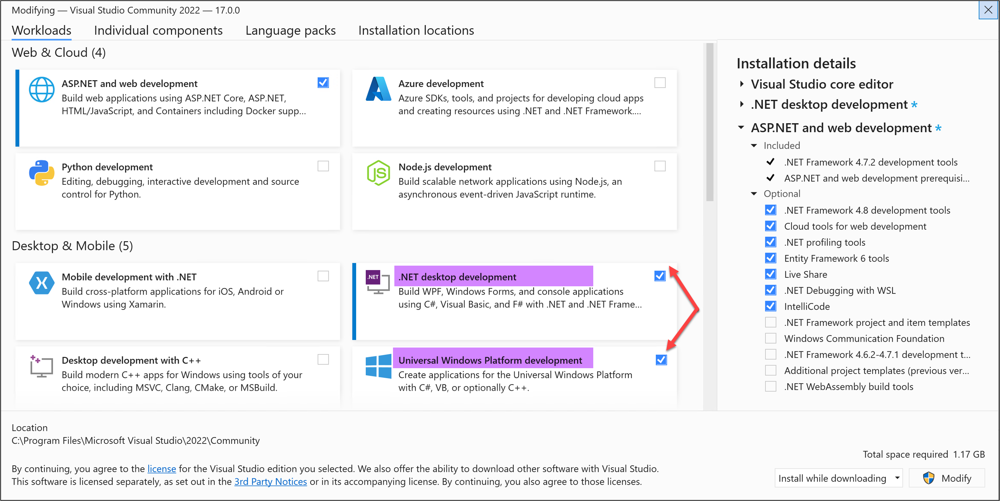

# Submission to Windows Store

This articles describes the workflow of publishing the new version of an application to Windows Store.

In Windows Store terms process of submission of a new version is called **Submission**. Submission includes the packages, information about the new version including version changes, screenshots, etc.

Each new submission starts and is based on previous submission. During new submission its enough to update just package, but there's a possibility to change version descriptions, screenshots, videos and other details.

Texts, pictures and images can be translated to different languages. In this case Windows Store will show user page about GIMP localized to specific language. The same is for package: anything in the package including texts, images and even markup can be altered during localization.

Currently solutions in this folder automotize the packages creation only. However, it is possible to automate the package submissions as well which is a subject of future improvements.

Currently only english language is declared at both store and package.

## Software Requirements

- Windows 11 x-64 bit
- Visual Studio 2022 Community Edition
  - Following components needs to be installed
    - .Net desktop development
    - Universal Windows Platform development
  - 
- 7-Zip x-64 bit
  - 7-zip should be installed to default location.

## Workflow

1. Open "src\Prepare.sln" in Visual Studio and Menu \ Build \ Rebuild Solution
2. Solution Explorer right click "Prepare" project, "Set as startup project"
3. Launch it (F5)
4. Open "src\Wrapper.sln" in Visual Studio and Menu \ Build \ Rebuild Solution
5. Solution Explorer right click "LauncherPackage" project, Publish \ Create App Packages
6. Publish src\LauncherPackage\AppPackages\LauncherPackage_XXXX_bundle.appxupload to store
